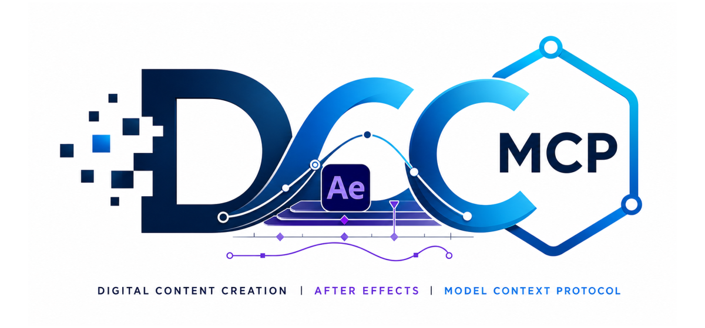

# dcc-mcp-aftereffects

<p align="center">
  
</p>

## Agent workflow

AI agents should use the shared gateway through `dcc-mcp-cli`; IDE users may
continue to use the MCP endpoint. Prefer typed skills and tools over raw scripts.

### Install or update the CLI

`dcc-mcp-cli` is the preferred control path for every shell-capable agent. If
it is missing, ask the user before installing the latest official release:

```bash
# Linux/macOS
curl -fsSL https://raw.githubusercontent.com/dcc-mcp/dcc-mcp-core/main/scripts/install-cli.sh | sh

# Windows PowerShell
powershell -ExecutionPolicy Bypass -c "irm https://raw.githubusercontent.com/dcc-mcp/dcc-mcp-core/main/scripts/install-cli.ps1 | iex"
```

Keep an official build current through the release manifest:

```bash
dcc-mcp-cli update check
dcc-mcp-cli update apply
```

`update apply` downloads and stages the latest CLI for the next launch. It
does not update a running `dcc-mcp-server`; update that server in its own
environment.

```bash
dcc-mcp-cli dcc-types
dcc-mcp-cli list
dcc-mcp-cli search --query "<task>" --dcc-type aftereffects
dcc-mcp-cli describe <tool-slug>
dcc-mcp-cli call <tool-slug> --json '{"key":"value"}'
```

`dcc-types` reports release-catalog support; `list` reports live sessions. If a
tool belongs to an inactive progressive skill, call `dcc-mcp-cli load-skill <skill-name> --dcc-type aftereffects` before retrying. For post-task improvement,
attach a stable session id with `--meta-json`, query `dcc-mcp-cli stats --range 24h --session-id <task-id>`, then pass the bounded evidence to the
`review_skill_improvement` prompt from `dcc-mcp-skills-creator`.


MCP adapter for Adobe After Effects, built on the shared `adobepy` broker, CEP bridge, and typed facade.

```bash
pip install dcc-mcp-aftereffects
```

Use the standard adapter-owned lifecycle; it stages the official adobepy CEP
bridge without putting `ADOBEPY_TOKEN` in process arguments:

```bash
dcc-mcp-aftereffects install --json --dry-run --dcc-path "<host>" --python "<python>"
dcc-mcp-aftereffects install --json --yes --dcc-path "<host>" --python "<python>"
dcc-mcp-aftereffects verify --json --dcc-path "<host>" --python "<python>"
```

See [install.md](install.md) for supported Windows/macOS paths, the Linux
boundary, adobepy CLI provisioning, receipt-driven upgrade/uninstall, stable
exit codes, and troubleshooting. Each adapter instance uses an OS-assigned
port and registers it for CLI discovery. Connect through the stable gateway at
`http://127.0.0.1:9765/mcp`; set `DCC_MCP_AFTEREFFECTS_PORT` only when a fixed
direct endpoint is required.

Set `ADOBEPY_TOKEN` to the same non-default token used when installing the bridge.

The adapter reports ready only after the target After Effects bridge advertises
the complete typed/official-DOM contract and a real host version RPC succeeds.
A broker process is stopped only when it was started by this adapter.

## Skill groups

- `aftereffects-project`: inspect/open/save projects, list and import project
  items, create compositions, and run the motion-intro workflow.
- `aftereffects-layers`: inspect compositions, layers, effects, masks, and text;
  create text/solid/footage layers; edit text, transforms, keyframes, and order.
- `aftereffects-render`: inspect and control the render queue, queue
  compositions, and configure render settings and output modules.
- `aftereffects-advanced`: structured access to the complete official object
  model. Raw ExtendScript is an explicit destructive fallback, not the primary
  API.

Load a group before first use when progressive loading is enabled:

```bash
dcc-mcp-cli load-skill aftereffects-layers --dcc-type aftereffects
dcc-mcp-cli search --query "create text layer" --dcc-type aftereffects
```
